# PGSharp_ja

##### 1. Custom Shortcuts
カスタムショートカット

PGSharp ロゴの下のドロップダウン メニューから希望のアイコンを選択するメニュー。  

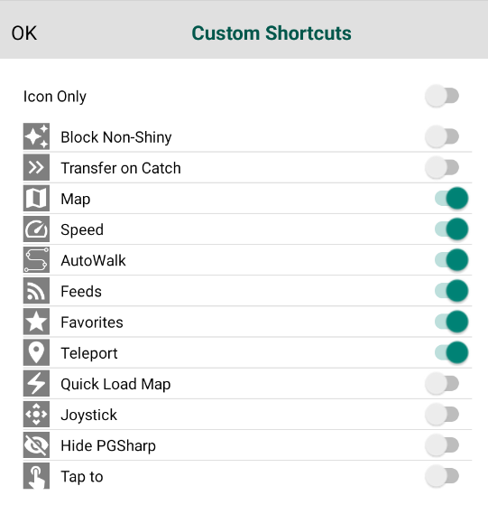

##### 2. Speed
スピード

スライダーを使用するか、アバターがどのくらいの速度で歩くかを時速 km 単位で入力します。

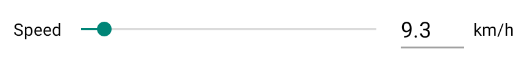

##### 3. Spoofing Location
なりすましの場所

これがSpoofing(PGSharp)の主な機能です。世界中どこにいてもプレイできるようになります。位置偽装をしないで実際の位置でプレイしたい場合は、オフにしてください。

##### 4. Joystick
ジョイスティック

ジョイスティックを使用してアバターを手動で移動する場合は、これをオンにします。ショートカットで歩く/自転車/車を使用している場合はオフにしてください。

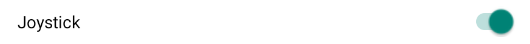

##### 5. Hide PGSharp
PGSharpを隠す

これを有効にすると、すべての PGSharp UI が非表示になります (スクリーンショットを撮るのに非常に便利です)。3 本の指で画面をタップ/スワイプすると元に戻ります。

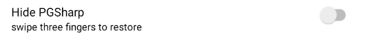

##### 6. Hide Trainer Name
トレーナー名を隠す

メイン画面およびプロフィール画面からトレーナー名を非表示にします。スクリーンショットに最適です。

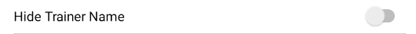

##### 7. Inventory IV
インベントリIV

これにより、BOXでポケモンを確認するときにポケモンの個体値が表示されます。

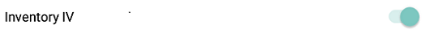

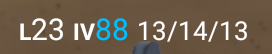

##### 8. Encounter IV
遭遇Ⅳ

遭遇・捕獲する時のポケモンの個体値を表示します。

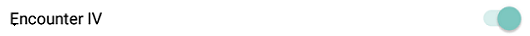

##### 9. Caught Preview
キャッチプレビュー

ポケモンが捕まえられたか、ボールから出たか、逃げたかを示します。

Caught:捕まえた
Escaped:ボールから出た
fled:逃げた

※クールダウン中は全て逃げられます。

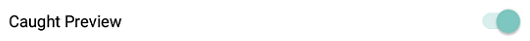

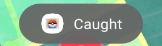

##### 10. Enhanced Throw
スロー強化

この機能を使用すると、任意のタイプのスローができます。

・**Nice** : 常にナイススロー　20XP  
・**Great**: 常にグレートスロー　100XP
・**Excellent** : 常にエクセレントスロー　1000XP
(複数が有効になっている場合、その中で一番良いスローになります）
・**Curveball**: ボールをどのように投げても常にカーブボールになります　10XP
・**AR+** : AR モードでスローした判定になります。　300XP
・**100% Hit**: どこに投げても、落としても100%ヒットします。(ヒットしても100%捕まえれるわけではありません。 )  
・**Auto Feed Pinap**: パイルの実を野生のポケモンに自動的に与えます。（所持している場合のみ）

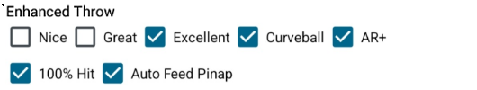

##### 11. Map
地図

虫眼鏡を使用して任意の偽装場所を検索できるマップ。マップ画面をタップしてその場所にテレポートまたは歩いたり、カスタムルートを作成したり、特定の場所をお気に入りにしたり、どこにいてもポケストップやジムを表示したりできます。

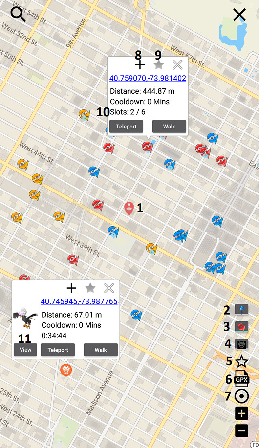
1 – 現在地  
2/3/4 – タップして近くのポケストップ/ジム/レイドを表示します。  
5 – タップしてお気に入り一覧を開きます  
6 – タップして GPXファイルをインポートします  
7 – タップして画面の中心の位置を表示します  
8 – タップして 2 番目のポイントを追加し、カスタムルートを作成します
9 – タップして位置をお気に入りに追加します  
10 – ジムの空き/占有スロットを表示します  
11 – タップしてレイドを直接表示します

##### 12. Tap to Walk/Teleport
タップして歩く/テレポートする

これにより、Pokémon Go マップ上でタップした場所に歩いたりテレポートしたりできるようになります。

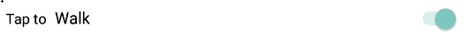

##### 13. Nearby Radar
近くのレーダー

マップ上で近くに出現するようポケモンを選択して表示できます。バー上のポケモンをタップすると、即座にテレポートする/歩くことができます。その場で遭遇したい場合は、そのポケモンをダブルタップします。
1 – 近くのレーダーに表示したいポケモンを選択します。色違いポケモンをスキャンしたい場合は、「All Possible Shiny」を選択します。  
2 – 検索したい特定のタイプのポケモンを選択できます (特定のタイプを捕まえるタスクに役立ちます)。  
3 – Shiny Scanner 機能をオンにします。  
4 – 近くのレーダーバーで遭遇した色違いポケモンのみを表示します。  
5 – マップ上のポケモンを光る姿で表示します。  
6 – 地図上に光るアイコンが表示されたときに電話通知を受け取ります。  
7 – 歩き回っているときにマップ上に光るポケモンが表示されると、自分で歩き始めるか光るポケモンを捕まえるまで停止します。  
8 – 光るポケモンがマップ上に表示されると VGP が一時停止されるため、VGP が試みる前にポケモンを捕まえることができます。

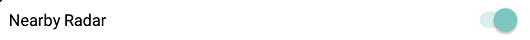

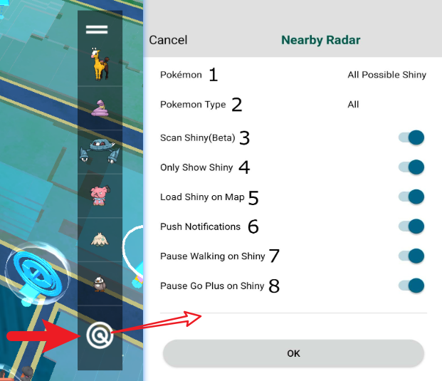

##### 14. Quick Sniper I/II
クイックスナイパーⅠ・Ⅱ

ポケモンのフィードを画面上に表示できます。

**ポケモンフィード**: 現在世界中で出現している個体値 100 のポケモンを見ることができます。探しているポケモン、欲しい個体値、性別、さまざまなフォルム、探しているレベル、ポケモンを見つけるために移動したい距離などのカスタムフィードを作成できます。  
**レイド フィード**: 進行中のレイドをライブで確認し、レイドの人気 (ロビーが常にかなりいっぱいである場合など)、距離 (レイドまでの距離)、残り時間 (レイドの残り時間)、およびレベル (レイドのスター レベルは何か) に基づいてフィルタリングできます。特定のレベルのレイド、元レイド候補のジム、強化された天候、ジムを管理するチームのカラーのみを検索するなど、カスタム フィードを作成することもできます。  
**クエストフィード**：ポケストップから特定のクエストを表示できます。メガエネルギー、スターダスト、アイテム（ゴールデンラズベリー、レアキャンディなど）、クエストから入手できるポケモンなど、特定のクエスト用の特定のフィードをカスタマイズして作成できます。 

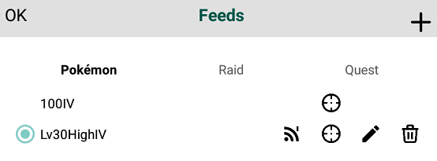

##### 15. Cooldown Timer
クールダウンタイマー

テレポートするときに、クールダウン期間を有効にしている場合は、タイマーが開始され、  
どれくらい待つ必要があるかを知らせます。それをタップすると、クールダウン履歴が表示されます。\[[詳細](https://www.pgsharp.com/cooldown-rules/)\]  
注: クールダウン タイマーは、PGSharp の外部で行った操作を追跡できないことに注意してください。

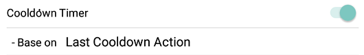

##### 16. Auto Incubator

オートインキュベーター

選択した設定に応じて、卵が自動的に孵化します。「最短優先」は、孵化時間が最も短い卵に焦点を当て、最初に孵化させます。「最長優先」は、孵化時間が最も長い卵に焦点を当てます。卵が孵化すると、選択した設定に応じて別の卵が自動的に入れられます。この機能は無料の無制限のインキュベーターのみを使用することに注意してください。

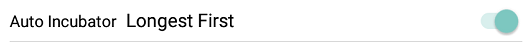

##### 17. Quick Catch
クイックキャッチ

キャッチをスキップしてマップ画面に戻ります。(ポケモンが捕まえられなかった場合、ボールの揺れや飛び出しもスキップされます。)

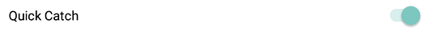

##### 18. Skip Cutscenes
カットシーンをスキップする

取引、タマゴの孵化、ポケモンの進化など、ほとんどのカットシーンをスキップします。

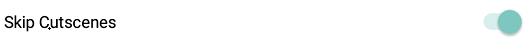

##### 19. Block Non-Shiny
光沢のないブロック

ポケモンをタップしたときに光っていない場合は、エンカウント画面に入りません。

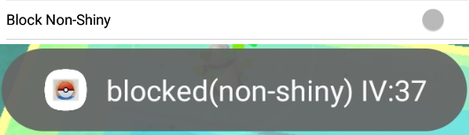

##### 20. Quick Load Map
クイックロードマップ

新しい場所にテレポートした後、マップをより速くロードできるようになることもあります。(特に素早くテレポートしている場合は、読み込みが遅くなることがあります。)

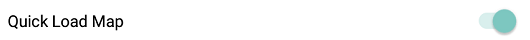

##### 21. Spawn Booster
スポーンブースター

アバターの周囲に出現するポケモンの半径を広げます。

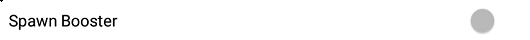

##### 22. Auto Discard Items
自動廃棄アイテム

どのアイテムを保持し、  
ギフト、ポケストップ、レイドなどから自動削除するかをカスタマイズできます  
。アイテムに触れさせずに自動破棄したくない場合は、空白のままにしておきます。アイテムをバッグからすぐに削除して  
自動的に破棄する場合は、0 を入力します。ハイパー ポーションを 5 つだけ持ちたい場合は、(たとえば) 5 のような数字を入力します  
。ハイパー ポーションが 5 つになると、それらは自動的に破棄されます。

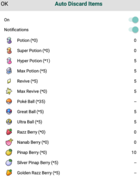

##### 23. Transfer on Catch
キャッチ時に転送

選択したオプションに当てはまらないすべてのポケモンを自動的に転送します
(レイドポケモン、クエストからのポケモン、ロケットのしっぽ/リーダーからのタマゴやシャドウポケモンは転送されません)。

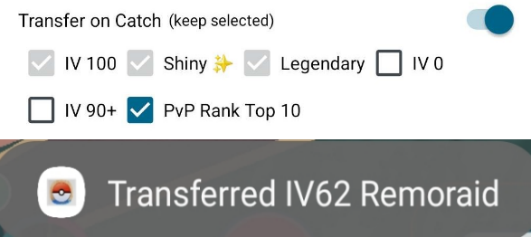

##### 24. Virtual Go Plus (VGP)
バーチャルゴープラス(VGP)

自動的にポケモンを捕まえようとし、スピンが停止する仮想ヘルパー。 
プッシュ通知– 携帯電話に通知を送信します。
近くのポケモン– VGP が近くのポケモンを捕まえようとする場合は、これをオンにします (保管スペースと赤いモンスターボールがある場合)。
近くのポケストップ– VGP がアバターの近くでポケトップを回転させたい場合は、これをオンにします (バッグにスペースがある限り)。

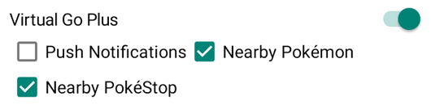

##### 25. Instant Beat Team Rocket
インスタントビートロケット団

ロケット団のメンバー全員、ボス (アーロ、クリフ、シエラ)、ジョバンニと戦うことなく、数秒で倒すことができます。あなたが最初に戦うことを選んだポケモンは、戦闘ごとに HP を 1 つだけ失います。

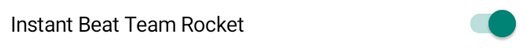

##### 26. Raid & Gym Battle Assistant
レイド＆ジムバトルアシスタント

レイドバトルやジムバトル中に自動タップ、回避、チャージ攻撃を行います。

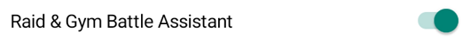

##### 27. Gift Assistant
ギフトアシスタント

開封とギフトの送信のアニメーションをスキップします。ギフトをクリックするとギフトの開封がすぐに行われ、ギフトのアイコンをタップすると友人への送信が完了します。ギフトにステッカーを追加したい場合は、ステッカーオプションをチェックしてください。

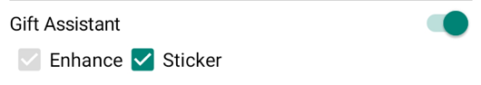

##### 28. Quest Assistant
バディアシスタント

友達が持ってきたギフトを自動的に再生、スナップショットを撮り、フィードし、開封します。オプションを選択すると、相棒にどのベリー/ポフィンを与えるかを選択できます。
リストの最初にあるオプションが選択されることに注意してください (リストは poffin で始まります)。ベリー/ポフィンを選択していて、どれも持っていない場合は、選択したベリーの後に来る次のベリーが選択されます。

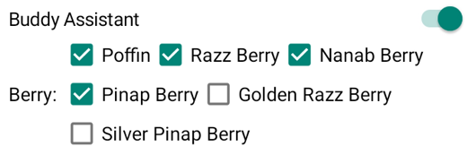

##### 29. Quest Assistant
クエストアシスタント

受信したスナップショット クエストは自動的に完了します。
例: 「5 つの異なる水種のスナップショットを撮る」、「野生のポケモンのスナップショットを撮る」など。

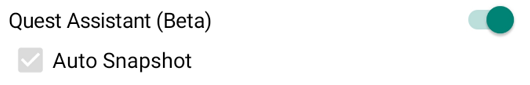

##### 30. Pokémon Name Generator
ポケモン名ジェネレーター

選択したオプションに応じて、手動以外で名前を付けたすべてのポケモンの名前を変更します。(注: 名前の変更は自分だけが見ることができます)

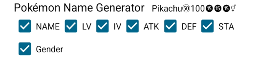

##### 31. PvP Rank
PvPランク

エンカウンター/インベントリー IV のレベルとリーグに基づいた PvP ランキングを表示します。PVP ランクまたは Google の詳細については、ここをクリック
してください。

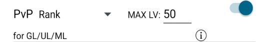
