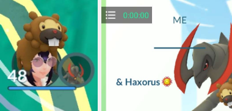
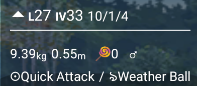
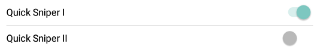

# PGSharp_ja

##### カスタムショートカット

PGSharp ロゴの下のドロップダウン メニューから希望のアイコンを選択するメニュー。  

##### スピード

スライダーを使用するか、アバターがどのくらいの速度で歩くかを時速 km 単位で入力します。

##### なりすましの場所

これがスプーフィングの主な機能です。世界中どこにいてもプレイできるようになります。歩き回れずに実際の場所でプレイしたい場合は、オフにしてください。

##### ジョイスティック

ジョイスティックを使用してアバターを手動で移動する場合は、これをオンにします。オプションをタップして歩く遊びをしたい場合は、オフにしてください (詳細は以下をご覧ください)。

##### PGSharpを隠す

これを有効にすると、すべての PGSharp UI が非表示になります (スクリーンショットを撮るのに非常に便利です)。3 本の指で画面をタップ/スワイプすると、すべてが元に戻ります。

##### トレーナー名を隠す

メイン画面および「自分」セクションからトレーナー名を非表示にします。スクリーンショットに最適です。

##### インベントリIV

これにより、インベントリでポケモンを確認するときにポケモンの個体値が表示されます。

##### 邂逅Ⅳ

遭遇・捕獲画面にいるポケモンの個体値を表示します。

##### キャッチプレビュー

ポケモンが捕まえられたか、逃げたか、逃げたかを示します。

##### 強化された投げ

この機能を使用すると、任意のタイプの投げを投げることができます。

**Nice** : 常にナイススロー、20 XP。  
**グレート**: 常にグレートスロー、100XP。  
**Excellent** : 常に優れたスロー、1000XP。  
(複数がアクティブ化されている場合、より良い方が上書きされます)  
**カーブボール**: ボールをどのように投げたかに関係なく、常にカーブボール ボーナス (10XP) を与えます。  
**「AR+」** : AR モードでプレイしているかのように、キャッチごとに 300 XP が追加されます (300 XP)。  
**100% ヒット**: 画面上のどこにでもボールを投げたり落としたりでき、常にヒットとしてカウントされます。( 100% ヒットしても 100% キャッチできるわけではないことに注意してください。 )  
**自動餌付けピナップ**: ピナップベリーを野生のポケモンに自動的に与えます。（あなたがそれらを持っている限り。）

##### 地図

虫眼鏡を使用してなりすましの場所を検索できるマップ。マップ画面をタップしてその場所にテレポートまたは歩いたり、カスタム ルートを作成したり、特定の場所をお気に入りにしたり、どこにいてもポケストップやジムを表示したりできます。

1 – 現在地  
2/3/4 – タップして近くのポケストップ/ジム/レイドを表示します。  
5 – タップしてお気に入りセクションを開きます  
6 – タップして GPX ファイルをインポートします  
7 – タップして画面の中心に位置を表示します  
8 – タップして 2 番目のポイントを追加し、カスタムルートを作成します 9  
– タップして位置をお気に入りに追加します  
10 – ジムの空き/占有スロットを表示します  
11 – タップしてレイドを直接表示します

##### タップして歩く/テレポートする

これにより、Pokémon Go マップ上でタップした場所に歩いたりテレポートしたりできるようになります。

##### 近くのレーダー

マップ上で近くにスポーンするように表示するポケモンを選択できます。バー上のポケモンをタップすると、即座にテレポート/ウォークできます。直接遭遇するポケモンをダブルタップします。

1 – 近くのレーダーに表示したいポケモンを選択します。可能性のある光るポケモンをスキャンしたい場合は、「すべての可能性のある光る」を選択します。  
2 – 検索したい特定のタイプのポケモンを選択できます (特定のタイプのクエストを捕まえるのに役立ちます)。  
3 – Shiny Scanner 機能をオンにします。  
4 – 近くのレーダーバーで遭遇した光るポケモンのみを表示します。  
5 – マップ上のポケモンを光る姿で表示します。  
6 – 地図上に光るアイコンが表示されたときに電話通知を受け取ることができます。  
7 – 歩き回っているときにマップ上に光るポケモンが表示されると、自分で歩き始めるか光るポケモンを捕まえるまで停止します。  
8 – 光るポケモンがマップ上に表示されると VGP が一時停止されるため、VGP が試みる前にポケモンを捕まえることができます。

##### クイックスナイパーⅠ・Ⅱ

ポケモンのフィードを画面上に表示できます。

**ポケモンフィード**: 現在世界中で出現している個体値 100 のポケモンを見ることができます。探しているポケモン、欲しい個体値、性別、さまざまなフォルム、探しているレベル、ポケモンを見つけるために移動したい距離などのカスタムフィードを作成できます。  
**レイド フィード**: 進行中のレイドをライブで確認し、レイドの人気 (ロビーが常にかなりいっぱいである場合など)、距離 (レイドまでの距離)、残り時間 (レイドの残り時間)、およびレベル (レイドのスター レベルは何か) に基づいてフィルタリングできます。特定のレベルのレイド、元レイド候補のジム、強化された天候、ジムを管理するチームのカラーのみを検索するなど、カスタム フィードを作成することもできます。  
**クエストフィード**：ポケストップから特定のクエストを表示できます。メガエネルギー、スターダスト、アイテム（ゴールデンラズベリー、レアキャンディなど）、クエストから入手できるポケモンなど、特定のクエスト用の特定のフィードをカスタマイズして作成できます。 

##### クールダウンタイマー

テレポートするときに、クールダウン期間を有効にしている場合は、タイマーが開始され、  
どれくらい待つ必要があるかを知らせます。それをタップすると、クールダウン履歴が表示されます。\[[詳細](https://www.pgsharp.com/cooldown-rules/)\]  
注: クールダウン タイマーは、PGSharp の外部で行った操作を追跡できないことに注意してください。

##### オートインキュベーター

選択した設定に応じて、卵が自動的に孵化します。「最短優先」は、孵化時間が最も短い卵に焦点を当て、最初に孵化させます。「最長優先」は、孵化時間が最も長い卵に焦点を当てます。卵が孵化すると、選択した設定に応じて別の卵が自動的に入れられます。この機能は無料の無制限のインキュベーターのみを使用することに注意してください。

##### クイックキャッチ

キャッチをスキップしてマップ画面に戻ります。(ポケモンが捕まえられなかった場合、ボールの揺れや飛び出しもスキップされます。)

##### カットシーンをスキップする

取引、タマゴの孵化、ポケモンの進化など、ほとんどのカットシーンをスキップします。

##### 光沢のないブロック

ポケモンをタップしたときに光っていない場合は、エンカウント画面に入りません。

##### クイックロードマップ

新しい場所にテレポートした後、マップをより速くロードできるようになることもあります。(特に素早くテレポートしている場合は、読み込みが遅くなることがあります。)

##### スポーンブースター

アバターの周囲に出現するポケモンの半径を広げます。

##### 自動廃棄アイテム

どのアイテムを保持し、  
ギフト、ポケストップ、レイドなどから自動削除するかをカスタマイズできます  
。アイテムに触れさせずに自動破棄したくない場合は、空白のままにしておきます。アイテムをバッグからすぐに削除して  
自動的に破棄する場合は、0 を入力します。ハイパー ポーションを 5 つだけ持ちたい場合は、(たとえば) 5 のような数字を入力します  
。ハイパー ポーションが 5 つになると、それらは自動的に破棄されます。

##### キャッチ時に転送

Automatically transfers all Pokémon that do not fall into the options you select  
(does not transfer raid Pokémon, Pokémon from quests, eggs or shadow Pokémon from rocket grunts/leaders).

##### Virtual Go Plus (VGP)

A virtual helper that will automatically try to catch Pokémon and spin stops for you.   
**Push Notifications** – Sends notifications to your phone.  
**Nearby Pokémon** – Turn this on if you want the VGP to attempt to catch nearby Pokémon (if you have the storage space and red Pokéballs).  
**Nearby PokéStop** – Turn this on if you want the VGP to spin Pokétops near your avatar (as long as you have room in your bag).

##### Instant Beat Team Rocket

Allows you to defeat all Team Rocket members, bosses (Arlo, Cliff, and Sierra), and Giovanni in seconds, without ever having to fight them. The first Pokémon you choose to battle only loses one HP per battle.

##### Raid & Gym Battle Assistant

Auto taps, dodges, and charge attacks during Raids and Gym Battles.

![]img/raid-gym-battle-assistant.png)

##### Gift Assistant

Skips the animation of the opening and the sending of gifts. Opening the gift is done instantly as soon as you click on the gift, and sending it to your friend is done by tapping on the gift icon. Check the Sticker option if you would like stickers to be added to your gifts.

##### Buddy Assistant

Automatically play, take a snapshot, feed and open any gifts your buddy brings you. You can choose what berries/poffin it will feed your buddy by selecting the option.  
Please note that it will choose whatever option comes first in the list (list starts at poffin). If you have a berry/poffin selected that you do not have any of, it will pick the next berry that comes after what you have selected.

##### Quest Assistant

Will automatically complete any snapshot quests you receive.  
Example: “take snapshots of 5 different water species”, “take a snapshot of a wild Pokémon”, etc.

##### Pokémon Name Generator

Renames all non-manually named Pokémon depending on what options you select. (Note: only you can see the name change)

##### PvP Rank

エンカウンター/インベントリー IV のレベルとリーグに基づいた PvP ランキングを表示します。PVP ランクまたは Google の詳細については、[ここをクリック](https://www.pgsharp.com/pvp-rank/)  
してください。

